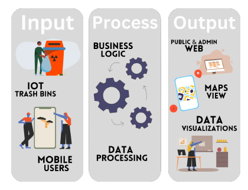
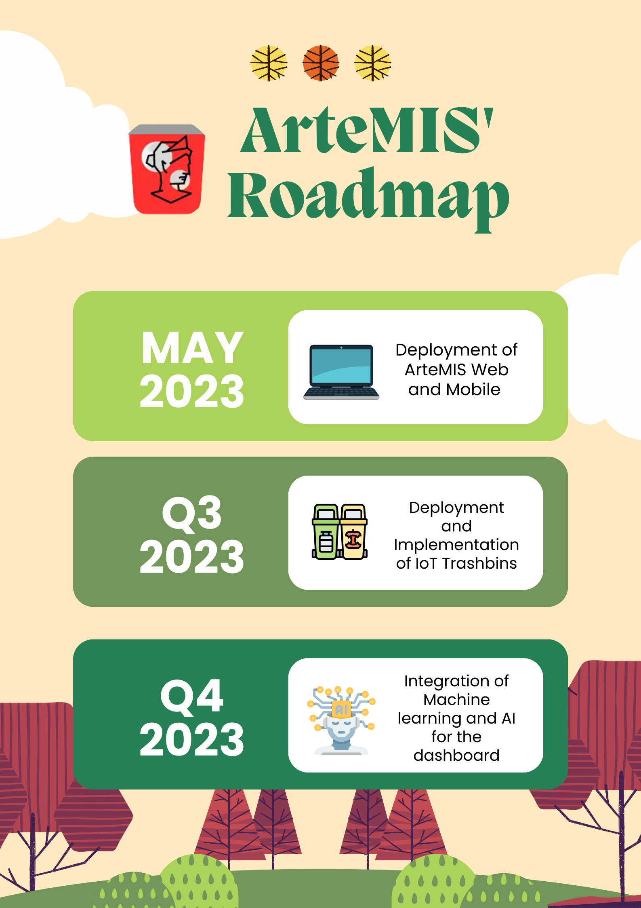

# [ArteMIS: Waste management information system](https://artemis-b18ae.web.app)
Aims to automate and innovate ways waste management system is being executed. This is through means of applying certain modernized technologies to an old existing system. Some of these are data processing, data visualization, and machine learning. Not only do ArteMIS brings modernized way of waste management but helps advocate the goals of it, to create a sustainable environment and proper waste segregation. 

Visit us by clicking the title of this section or through this [hyperlink](https://artemis-b18ae.web.app)


## The Process
<div align="center">

</div>

The following `Inputs` will be the data sources of ArteMIS. ArteMIS will utilize those data coming from multiple data sources and process it, applying certain business logic and store those processed data into a data lake or a database. Data from the database will then be fetched through the `ArteMIS API`, being able to output those data into a visualized manner which is reflected in both mobile and web dashboards. 

## The Roadmap
<div align="center">

</div>


## Data visiualization
The potential of visualizing data is limitless. It offers a lot of convenience rather than relying on old means of counting and excel-based visuals that for most is overwhelming. That is why most businesses other systems that contains overwhelming data seek to need data visualization. [Data visualization](https://hdsr.mitpress.mit.edu/pub/zok97i7p/release/4) offers analyzation of complex datam identifying patterns, and extracting valuable insights for faster and more efficient decision making. 

### Data visualization that ArteMIS contains:
- [x] Maps showing trash bins location and their capacity percentage
- [x] Trash bin activity through line graph 
- [x] Trash bin frequency per building 
- [x] Line graph of waste weight over time 
- [x] Line graph of waste weight per building over time 
- [x] Pie graph of waste type composition over time 
- [x] Percentage of waste generated per campus over all 
- [x] Ranking system per building 
- [x] Percentage of waste over the estimated total of the country's overall waste generated within the year. 

## The Tech stack and other tools and techs used 
- ReactJS - front-end 
- ExpressJS - API development through REST architecture 
- Android Studio SDK - mobile front-end 
- Firebase services - back-end as a service 
- Firebase Firestore - data storage 
- Firebase authentication - authentication 
- ChartJS - Data visuals 
- Open Street Map - Maps 

## ArteMIS API 
currently the API is not for public use and needs authentication for utilization. The API contains access to the implemented areas' waste management information that cannot be disclosed without prior notice and permission. Nonetheless, the documentation of the API can be seen in the [ArteMIS Server](https://github.com/SchadenKai/ArteMIS-Server) repository. 

## For contributors 

1. Clone this repository on your local machine 
```
git clone https://github.com/SchadenKai/ArteMIS-Waste-Management-System.git
```
2. Go to the cloned directory
```
cd artemis-waste-management-system
```
3. You must have Node JS and NPM. If not, download it, else install the following dependencies which can be seen in the `package.json` through the following command
```
npm i   /   npm install
```
4. Within the project's directory, run the development environment of the front-end of ArteMIS. 
```
npm run dev 
```
5. For open source contribution, commit your changes and create a pull request from your Github repo on the web. This will be reviewed by the dev team before merging it into the main branch 
```
// create your own branch before modifying and adding codes
git checkout -b "<branch name>"
// after integrating your changes 
git add * 
git commit -m "<detailed one liner commit message>"
git push origin main 
```

## Contacts 
For further information, collaboration and business talk, you can contact us through 

- Gmail - kairustecsonpersonal@gmial.com
